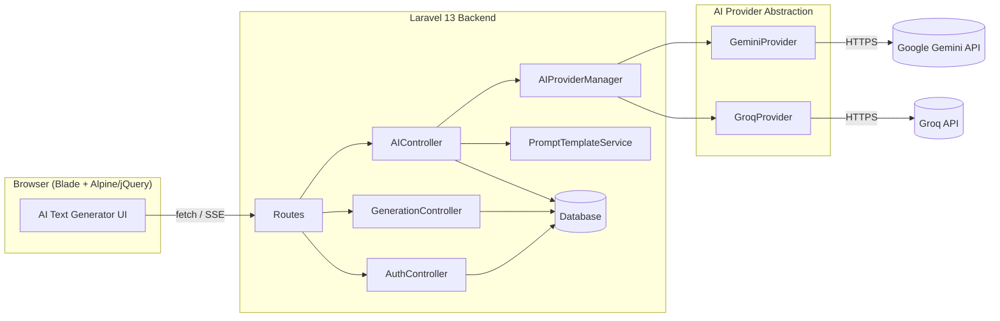

# AI Text Generator

A multi-provider AI content generation app built with Laravel 13. Streams responses live, compares outputs across models side-by-side, and ships with reusable prompt templates.


## Features

- 🔄 **Live streaming responses** via Server-Sent Events — no waiting for the full generation
- ⚖️ **Compare Mode** — run one prompt against Gemini and Groq simultaneously, see latency for each
- 📝 **Prompt templates** — structured presets for blog posts, emails, product copy, summaries, code explanations, and social captions
- 🧩 **Provider abstraction layer** — swapping or adding a new AI provider is a new class + one line in a config map, no controller changes
- 👤 **Optional auth** — the app is fully usable as a guest; logging in adds saved generation history
- 🌗 **Dark/light mode** with system preference detection
- ✅ **Tested** — Pest feature and unit tests, mocked providers, zero real API calls in CI
- 🚦 **CI pipeline** — lint + test on every push via GitHub Actions
- 🐛 **Error tracking** — Sentry integration for production visibility

## Architecture



Adding a new provider (e.g. Mistral Codestral) means: implement `AIProviderInterface`, register it in `AIProviderManager`, done — nothing else in the app needs to change.

## Tech Stack

- **Backend:** Laravel 13, PHP 8.3+
- **Frontend:** Blade, Tailwind CSS (CDN), jQuery, marked.js + DOMPurify for sanitized markdown rendering
- **AI Providers:** Google Gemini, Groq (OpenAI-compatible)
- **Testing:** Pest
- **CI:** GitHub Actions
- **Error tracking:** Sentry

## Setup

1. Clone and install dependencies:

```bash
   git clone https://github.com/YOUR_USERNAME/YOUR_REPO.git
   cd YOUR_REPO
   composer install
```

2. Configure environment:

```bash
   cp .env.example .env
   php artisan key:generate
```

3. Add your API keys to `.env`:
   GEMINI_API_KEY=your_key_here
   GEMINI_MODEL=gemini-3.5-flash
   GROQ_API_KEY=your_key_here
   GROQ_MODEL=openai/gpt-oss-120b
   AI_DEFAULT_PROVIDER=gemini

4. Run migrations:

```bash
   php artisan migrate
```

5. Serve:

```bash
   php artisan serve
```

## Testing

```bash
composer install --dev
vendor/bin/pest
vendor/bin/pint --test
```

## License

MIT
